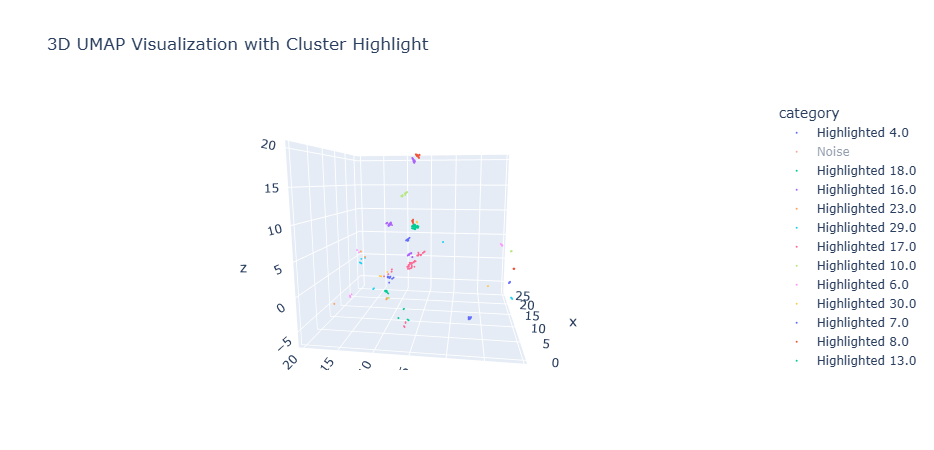
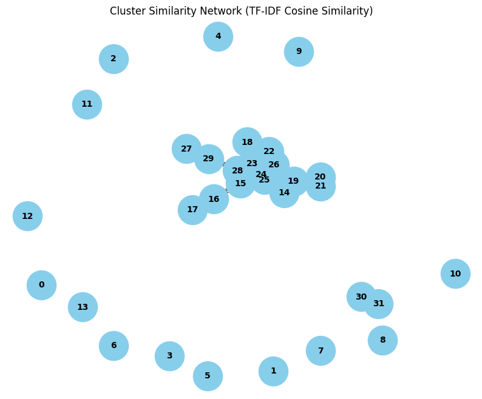

This code was built on Python 3.11.9 environtment.

This process adapted from A. Benayas, M. A. Sicilia, and M. Mora-Cantallops, “Automated Creation of an Intent Model for Conversational Agents,” Applied Artificial Intelligence, vol. 37, no. 1, p. 2164401, Dec. 2023, doi: 10.1080/08839514.2022.2164401. 

The main idea is text based dataset represented into 4 feature vectors: semantic vector (Vw), Lexical Vector/Top-K n-gram vector (Vk), Part of Speech (POS) tag vector (Vp), and LDA Probability K-topic vector (Vt). 

In addition, we use HDBSCAN clustering algorithm instead of ITER-HDBSCAN and we add vector Named Entity Recognition (NER) (Vner) to represent the general representation of text in the form of entities word tags.

## A. Dataset Preparation:
1. Prepare dataset, a text based sentences in a xlsx file format
2. Run stage-02 in yohanes.ipynb, where creates two columns: a clean version of sentences and deep_clean version
3. Run OpenAIEmbedding.ipynb if you want to embeddings the sentences using OpenAI embeddings (support multi languages) model using API (need an OpenAI API key). This process will creates a JSON file with embeddings vectors on each sentences (OpenAIEmbeddings_512_question.json, OpenAIEmbeddings_512_question_clean_simple.json).
4. Run openai.ipynb to initiate identification of entities using OpenAI API gpt-5 model. This will create a ner column to the dataset that tags possible words into pre-defined NER dictionary words.
5. The final output is an xlsx dataset (dataset.xlsx) where at least have original question, question_clean_simple, question_clean_deep, and ner column.
6. dataset.xlsx is real-world text-based user questions in the domain of Official Statistics (Statistics Indonesia - BPS, 2024) that has been anonimized and decomposed from original sentences.

## B. Reproduce:
1. In yohanes.ipynb, using dataset.xlsx, run Stage-01 to load the dataset in the dataframe.
2. Stage-03 to view the dataset, ensure requested colums are available (question, ner, question_clean_simple, question_clean_deep) and load to dataframe.
3. Stage-07: create vector ner and stage-08, scale vector ner. At this stage, the process have **[vectors_ner_power]**.
4. Stage-09: create semantic vector (OpenAI embeddings) or use IndoSBERT embedding in stage-10 or use MiniLMEmbeddings in stage-11. At this stage, the process have **[vectors_vw]**.
5. since OpenAI embeddings (stage-09) is already normalized, skip stage-13. However, use stage-13 if you run with IndoSBERT (stage-10) or MiniLMEmbeddings (Stage-11).
6. Stage-14: build top-K ngram word(s) from column question_clean_deep (clean from stopwords). Use stage-15 if you want to load custom list Top-K ngram dictionary.
7. Stage-16: create lexical vector (Vk) and scale it (stage-17). At this stage, the process have **[vectors_vk_power]**.
8. Stage-18: build a syntactic vector (Vp) per row using Stanza-id Indonesia (use another language as per dataset used) and then run stage-19 to scale Vp. At this stage, the process have **[vectors_vp_power]**.
9. Stage-20: Calculate best K-topic using LDA model. Run this stage to get the coherence value per K value, select K value with higher coherence score. Using this K value, run stage-21 to build Vt/topic vector or just set K value in stage-21. Normalized Vt awith stage-22 and the process now have **[vectors_vt_normal]**.
10. Stage-23: concatenate **[vectors_vw]**, **[vectors_vk_power]**, **[vectors_vp_power]**, **[vectors_vt_normal]**, **[vectors_ner_power]**. at this stage the process have **[vectors_concat]**.
11. Stage-27: **[vectors_concat]** dimensionality reduction with UMAP. At this stage, the process have **[vectors_reduce]**.
12. Stage-28: Normalize **[vectors_reduce]** with L2, the output is **[vectors_norm]**. This **[vectors_norm]** will now be used as an input in HDBSCAN clustering algorithm.
13. Stage-29 and Stage-30: Data vectors visualization by reduce ist dimensionality to 3 with UMAP.
14. Stage-33: setting HDBSCAN parameter min_cluster_size and min_samples and run the algorithm.
15. Stage-37: Evaluate the cluster with silhouette_score, davies_bouldin_score, and calinski_harabasz_score. Those are internal evaluation metrics, where the assessment of the clustering quality is based solely on the dataset and the clustering results, and not on external, ground-truth labels.

## C. Experiment:
Using dataset.xlsx with 2756 records, we run HDBSCAN using several cases combination:
1. concat([vectors_vw], [vectors_vk_power], [vectors_vp_power], [vectors_vt_normal])
2. concat([vectors_vw], [vectors_vk_power], [vectors_vp_power], [vectors_vt_normal], [vectors_ner_power]) 
3. [vectors_vw]
4. [vectors_vk_power]
5. [vectors_vp_power]
6. [vectors_vt_normal]
7. [vectors_ner_power]

## D. Parameters:
1. For semantic vector **vw**, the embeddings use IndoSBERT model that support Indonesian sentences with vector length=256 (2756x256) and using OpenAI embeddings API (model: text-embedding-3-small) that support multi languages with length=512 (2756x512)
2. Using top-K = 30 with 1-4 ngram for lexical vector **vk** (2756x120)
3. For LDA topic vector **vt**, using T=8 (2756x8)
4. Part of speech (POS) vector **vp** using 17 predefined tags based on Universal POS Tag set (2756x17)
5. For vector entity **vner**, we define 28 entites based on SDMX concept on Data Structure Definition (measure, dimension, attribute, item list, etc.): ['ATTRIBUTE', 'DATA_VALUE', 'FACTORY', 'FILE_FORMAT', 'FREQUENCY', 'HOW', 'HOW_MANY', 'HOW_MUCH', 'INDICATOR', 'ITEM', 'LANGUAGE', 'LAW', 'NORP', 'NUMBER', 'ORG', 'OTHER_DIMENSION', 'PERSON', 'PRODUCT', 'QUESTION_MODAL', 'REF_AREA', 'TIME_PERIOD', 'UNIT_MEASURE', 'WHAT', 'WHEN', 'WHERE', 'WHICH', 'WHO', 'WHY'], therefore vector shape is (2756x28)
6. HDBSCAN min_cluster_size and min_samples range from 5, 10, 15, 25 (min_cluster_size=5 and min_samples=5, min_cluster_size=10 and min_samples=5, min_cluster_size=10 and min_samples=10, min_cluster_size=15 and min_samples=10, min_cluster_size=15 and min_samples=15, min_cluster_size=20 and min_samples=15, min_cluster_size=20 and min_samples=20, min_cluster_size=25 and min_samples=20, min_cluster_size=25 and min_samples=25)
7. Using UMAP dimensional reduction to 120 dimension (2756x120)

## E. Clustering Result
Using silhouette_score (higher is better) and davies_bouldin_score (lower is better), The tables below show the best combination in each vector combination:
| no | Semantic Embeddings | Combination | min cluster size | min samples | Total Cluster | Noise | Without Noise | silhouette score | davies bouldin score |
|----|----------------------|------------------|------------------|-------------|---------------|-------|---------------|----------------|-------------------|
| 1  | OpenAI text-embedding-3-small | concat(vw, vk, vp, vt) | 10 | 10 | 82 | 187 | 2569 | **0.9270** | **0.060** |
| 2  | OpenAI text-embedding-3-small | concat(vw, vk, vp, vt, vner) | 10 | 10 | 82 | 303 | 2453 | 0.9210 | 0.084 |

| no | Semantic Embeddings | Combination | min cluster size | min samples | Total Cluster | Noise | Without Noise | silhouette score | davies bouldin score |
|----|----------------------|------------------|------------------|-------------|---------------|-------|---------------|----------------|-------------------|
| 1  | OpenAI text-embedding-3-small | concat(vw, vk, vp, vt) | 15 | 15 | 65 | 217 | 2539 | 0.9028 | 0.097 |
| 2  | OpenAI text-embedding-3-small | concat(vw, vk, vp, vt, vner) | 15 | 15 | 61 | 385 | 2371 | **0.9234** | **0.069** |

| no | Combination | min cluster size | min samples | Total Cluster | Noise | Without Noise | silhouette score | davies bouldin score |
|----|------------------|------------------|-------------|---------------|-------|---------------|----------------|-------------------|
| 1  | vw only | 15 | 15 | 28 | 1136 | 1620 | 0.8184 | 0.156 |
| 2  | vk only | 20 | 20 | 33 | 1238 | 1518 | 0.8482 | 0.189 |
| 3  | vp only | 5 | 5 | 89 | 1079 | 1677 | 0.3155 | 0.568 |
| 4  | vt only | 25 | 25 | 14 | 1678 | 1078 | 0.9727 | 0.051 |
| 5  | vner only | 10 | 10 | 51 | 827 | 1929 | 0.5299 | **0.410** |
| 6  | vner only | 15 | 15 | 32 | 997 | 1759 | **0.5357** | 0.428 |

## F. Labeling
We start by exploring the clustering with vner only (min_cluster_size=15, min_samples=15, total cluster=32) to get the broad view of labels.

### Silhouette Score per Cluster (no noise)

| Cluster | Size | Silhouette Score | Negative Score |
|--------|------|------------------|----------------|
| 0  | 17  | 0.695693 | False |
| 1  | 44  | 0.614041 | False |
| 2  | 36  | 0.630584 | False |
| 3  | 53  | 0.735464 | False |
| 4  | 53  | 0.733180 | False |
| 5  | 61  | 0.817729 | False |
| 6  | 60  | 0.723059 | False |
| 7  | 86  | 0.727074 | False |
| 8  | 109 | 0.722162 | False |
| 9  | 77  | 0.538377 | False |
| 10 | 97  | 0.435204 | False |
| 11 | 91  | 0.365782 | False |
| 12 | 49  | 0.373557 | False |
| 13 | 140 | 0.481898 | False |
| 14 | 45  | 0.168217 | False |
| 15 | 44  | 0.188982 | False |
| 16 | 61  | 0.493565 | False |
| 17 | 242 | 0.185817 | False |
| 18 | 30  | 0.433404 | False |
| 19 | 24  | 0.626856 | False |
| 20 | 18  | 0.901341 | False |
| 21 | 29  | 0.896639 | False |
| 22 | 19  | 0.834834 | False |
| 23 | 24  | 0.777197 | False |
| 24 | 39  | 0.487644 | False |
| 25 | 52  | 0.763582 | False |
| 26 | 25  | 0.875315 | False |
| 27 | 23  | 0.765512 | False |
| 28 | 16  | 0.823704 | False |
| 29 | 37  | 0.730147 | False |
| 30 | 29  | 0.705608 | False |
| 31 | 29  | 0.381023 | False |

| Cluster ID | Top 10 terms (Entity Tags) | Proposed Label |
|------------|---------------------------|----------------|
| 0 | law, indicator, product, ref_area, number, file_format, data_value, what, org, other_dimension | Policy and Regulation-based Data and Metadata Inquiry |
| 1 | factory, indicator, item, ref_area, product, attribute, time_period, other_dimension, how, person |   |
| 2 | number, product, attribute, time_period, other_dimension, indicator, data_value, what, item, ref_area |   |
| 3 | how_much, indicator, product, time_period, ref_area, other_dimension, attribute, item, unit_measure, data_value |   |
| 4 | which, product, item, other_dimension, indicator, attribute, person, ref_area, time_period, data_value |   |
| 5 | when, product, time_period, attribute, indicator, ref_area, data_value, item, other_dimension, file_format |   |
| 6 | why, attribute, product, time_period, data_value, indicator, ref_area, item, other_dimension, unit_measure |   |
| 7 | where, indicator, person, time_period, product, ref_area, attribute, item, other_dimension, unit_measure |   |
| 8 | how_many, indicator, ref_area, time_period, other_dimension, item, product, unit_measure, attribute, what |   |
| 9 | file_format, product, ref_area, time_period, attribute, indicator, what, person, how, item |   |
| 10 | frequency, indicator, time_period, attribute, ref_area, product, item, what, how, other_dimension |   |
| 11 | org, indicator, ref_area, product, what, time_period, other_dimension, attribute, item, person |   |
| 12 | unit_measure, indicator, ref_area, product, time_period, other_dimension, attribute, what, how, item |   |
| 13 | question_modal, product, time_period, indicator, ref_area, attribute, other_dimension, item, person, how |   |
| 14 | data_value, ref_area, product, time_period, indicator, item, what, attribute, how, other_dimension |   |
| 15 | person, time_period, ref_area, indicator, what, product, item, other_dimension, why, question_modal |   |
| 16 | person, how, product, indicator, time_period, ref_area, attribute, other_dimension, what, question_modal |   |
| 17 | how, attribute, indicator, time_period, ref_area, product, other_dimension, what, why, question_modal |   |
| 18 | other_dimension, attribute, product, what, time_period, indicator, ref_area, why, which, question_modal |   |
| 19 | item, time_period, ref_area, product, indicator, what, when, why, which, question_modal |   |
| 20 | item, indicator, product, what, why, unit_measure, which, where, when, question_modal |   |
| 21 | item, product, what, why, which, unit_measure, time_period, where, when, question_modal |   |
| 22 | other_dimension, ref_area, indicator, product, what, when, why, where, which, question_modal |   |
| 23 | other_dimension, time_period, ref_area, indicator, product, what, when, why, which, question_modal |   |
| 24 | ref_area, time_period, indicator, what, why, when, where, unit_measure, which, question_modal |   |
| 25 | ref_area, time_period, indicator, product, what, when, where, why, which, question_modal |   |
| 26 | ref_area, product, indicator, what, why, when, unit_measure, where, which, question_modal |   |
| 27 | product, what, indicator, why, which, unit_measure, time_period, where, when, question_modal |   |
| 28 | time_period, indicator, product, what, why, when, unit_measure, where, which, question_modal |   |
| 29 | product, time_period, what, where, why, when, unit_measure, ref_area, which, question_modal |   |
| 30 | attribute, indicator, what, why, which, unit_measure, time_period, where, when, question_modal |   |
| 31 | attribute, product, what, time_period, indicator, when, why, where, which, question_modal |   |

